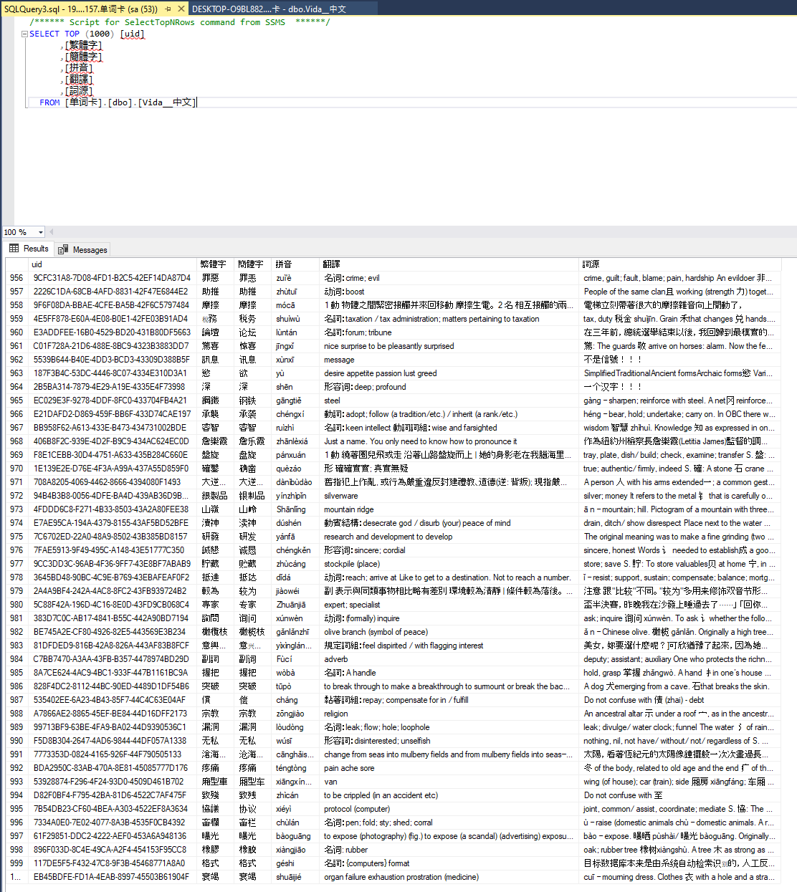

# Module 1 - Building Your Server Challenge

I exported my Chinese flashcards as a tab separated file, used regex to clean up the data, then re-exported as a CSV and imported it as a new database. I then created a new column, set it as the primary key, and set the default value to newid().

