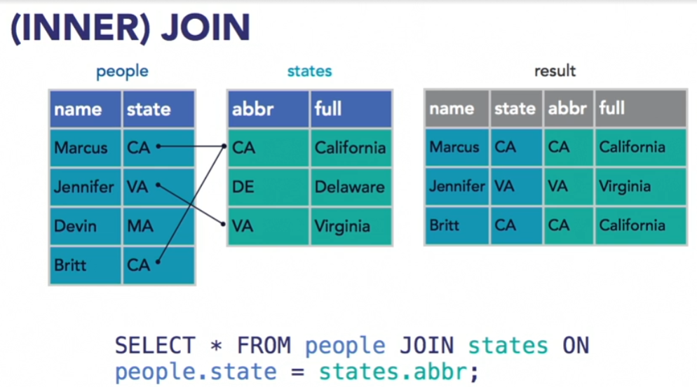
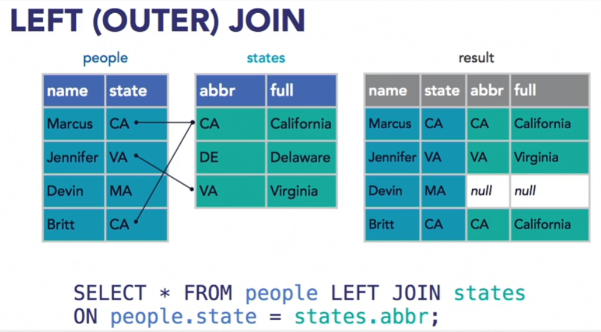
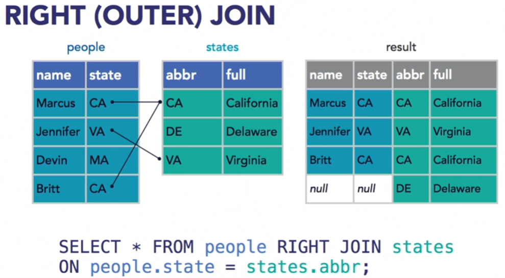
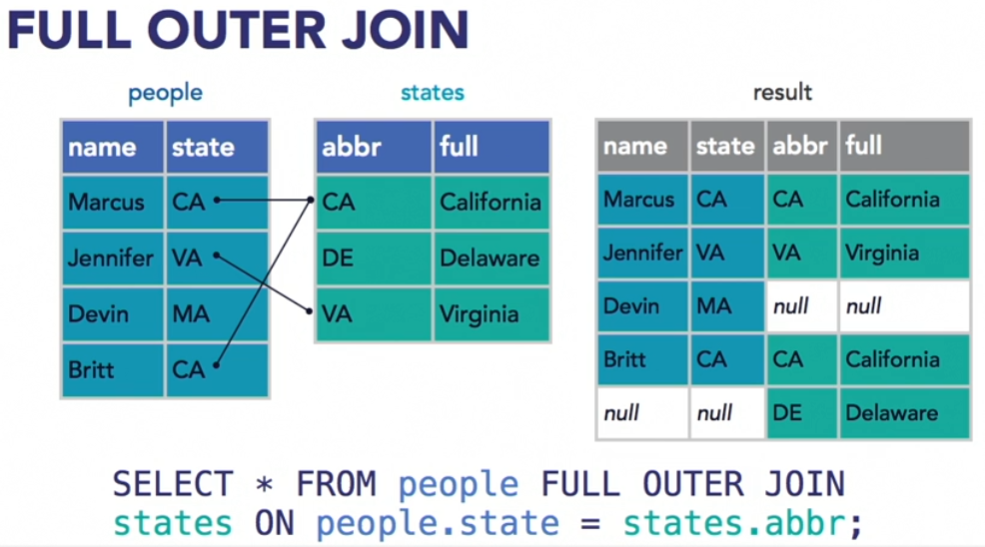
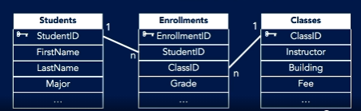

# Concepts

- [Concepts](#concepts)
  - [Module 1](#module-1)
    - [1 Understanding Data Storage Models](#1-understanding-data-storage-models)
      - [Hierarchical Databases](#hierarchical-databases)
      - [Relational Databases](#relational-databases)
    - [3 Understanding Data Definition Language](#3-understanding-data-definition-language)
      - [Create a new table](#create-a-new-table)
      - [Create New Database](#create-new-database)
      - [Use a Specific Database](#use-a-specific-database)
    - [Add/Drop a Column](#adddrop-a-column)
        - [Add Multiple Columns](#add-multiple-columns)
      - [Remove Data from a Table with Truncate](#remove-data-from-a-table-with-truncate)
      - [Copy a Table with Into](#copy-a-table-with-into)
    - [Understanding Data Manipulation Language](#understanding-data-manipulation-language)
      - [Using the Select Statement](#using-the-select-statement)
        - [Select Everything from a Table](#select-everything-from-a-table)
        - [Select Specific Columns](#select-specific-columns)
        - [Select Columns but Change Names on Output](#select-columns-but-change-names-on-output)
        - [Add a WHERE Clause](#add-a-where-clause)
        - [Add a conditional statement](#add-a-conditional-statement)
      - [Using the INSERT Statement](#using-the-insert-statement)
        - [Insert a Record](#insert-a-record)
        - [Insert a Record Using Specific Columns](#insert-a-record-using-specific-columns)
      - [Using the Update Statement](#using-the-update-statement)
      - [Delete Rows from Table](#delete-rows-from-table)
      - [Using MERGE to Combine Tables](#using-merge-to-combine-tables)
      - [Organize Responses with ORDER BY](#organize-responses-with-order-by)
      - [JOIN](#join)
        - [Inner vs Outer Join](#inner-vs-outer-join)
      - [GROUP BY](#group-by)
        - [Show Duplicates and Print Records](#show-duplicates-and-print-records)
      - [Useful Functions](#useful-functions)
        - [DISTINCT](#distinct)
        - [COUNT](#count)
    - [Understanding Relational Database Concepts](#understanding-relational-database-concepts)
      - [Relationships](#relationships)
      - [Indices](#indices)
      - [Schemas](#schemas)

## Module 1

### 1 Understanding Data Storage Models

#### Hierarchical Databases

- A parent can have many children but a child can only have one parent
- Has trouble modeling things that aren't "above and below"
- We use a relational database for complex structures

#### Relational Databases

- Break tables down into many separate tables to more easily relate the data
- Constraints: limit what you can do on a column. Only unique values etc
- Referential integrity - make sure related data exists in parent before allowing entries in the child
- MSSQL: uses transact SQL
- We always want to calculate values or derive them from existing data instead of storing the data and having to maintain it

### 3 Understanding Data Definition Language

- Used to define data structures in SQL server. These statements create and manipulate database objects. Employs USE, CREATE, ALTER, DROP, TRUNCATE, DELETE
- Write keywords using uppercase letters
- Terminator is `;`
- Comment is `--` for single line or `/* */` for multiline
- Ctrl+Shift+R refreshes the intellisense cache

#### Create a new table

```sql
CREATE TABLE ZhongwenTest (
	"Reasons it is hard" nvarchar(50) NOT NULL,
	"UID" uniqueidentifier DEFAULT newid()
);
```

#### Create New Database

```sql
CREATE DATABASE MyNewDatabase;
```

#### Use a Specific Database

``` sql
USE [database_name] -- Include the square brackets. They aren't required though unless you 
                    -- have a name with symbols.
```

### Add/Drop a Column

Replace the word `ADD` with `DROP` to drop something.

```sql
USE [database_name]
ALTER TABLE <TABLE_NAME>
ADD <COLUMN_NAME> <DATA_TYPE>
```

##### Add Multiple Columns

```sql
USE [database_name]
ALTER TABLE <TABLE_NAME>
ADD <COLUMN_NAME> <DATA_TYPE>,
    <NEXT_COLUMN_NAME> <NEXT_COLUMN_TYPE>
```

#### Remove Data from a Table with Truncate

```sql
USE [database_name]
TRUNCATE TABLE <TABLE_NAME>
```

#### Copy a Table with Into

```sql
USE [database_name]
SELECT *
INTO <NEW_TABLE_NAME>
FROM <COPY_SOURCE_TABLE>;
```

### Understanding Data Manipulation Language

- Includes the keywords SELECT INSERT UPDATE DELETE and MERGE
- Follows transactual processing. If one fails, the entire transaction fails and is rolled back.
- WHERE clause controls what records will be changed

#### Using the Select Statement

##### Select Everything from a Table

```sql
SELECT *
FROM <TARGET_TABLE>
```

##### Select Specific Columns

```sql
SELECT <COLUMN_1>, <COLUMN 2>,
FROM <TARGET_TABLE>
```

##### Select Columns but Change Names on Output

```sql
SELECT <COLUMN_1> AS [SOME NAME], <COLUMN 2> [SOME NAME]
FROM <TARGET_TABLE>
```

##### Add a WHERE Clause

```sql
SELECT <COLUMN_1> AS [SOME NAME], <COLUMN 2> [SOME NAME]
FROM <TARGET_TABLE>
WHERE <SOME_CONDITION>
```

Select every entry where food is in the translation
```sql
SELECT * FROM 我的單詞卡
WHERE CHARINDEX('food', 翻譯) > 0
```

Select something using regex
```sql
SELECT * FROM 我的單詞卡
WHERE Item LIKE 'V%'
```
where V is the letter V and % is any character.

##### Add a conditional statement
```sql
SELECT first_name, last_name, team
FROM people
WHERE state='CA' AND shirt_or_hat='shirt';
```

#### Using the INSERT Statement

##### Insert a Record
```sql
USE [database_name]
INSERT INTO <SOME_TABLE>
VALUES ('column 1 value', 'column 2 value', 'etc')
```

##### Insert a Record Using Specific Columns
```sql
USE [database_name]
INSERT INTO <TABLE> (COL1, COL2, COL3)
VALUES ('value 1', 'value 2', 'etc'),
       ('another record 1', 'another record 2', 'etc')
```

#### Using the Update Statement

```sql
USE [database_name]
UPDATE <TABLE_NAME>
SET <COLUMN_NAME> = <SOME_NEW_VALUE>
WHERE <COLUMN_NAME> = <SOME_CONDITION> 
```
If you drop the WHERE clause it will apply to every record.

#### Delete Rows from Table

```sql
DELETE
FROM <SOME_TABLE>
WHERE <SOME_CONDITION>; --Ex: WHERE CustomerID > 10055;
```

#### Using MERGE to Combine Tables

```sql
MERGE <TABLE_TO_MERGE_INTO>
USING <TABLE_TO_MERGE_FROM>
ON <SOME_CONDITION> -- Ex: Customers.CustomerID = CustomerUpdates.Customer ID
                    -- That is to say do it when the customer IDs match in both tables
WHEN MATCHED AND
  <OTHER_CONDITIONS> THEN -- Ex: CustomerUpdates.FirstName IS NOT NULL
  <DO WHATEVER - SET|INSERT|ETC>
```

#### Organize Responses with ORDER BY

Add `ASC` or `DESC` at the end to control for ascending or descending.

```sql
USE 单词卡
SELECT 繁體字 as 結果
FROM 我的單詞卡
WHERE CHARINDEX('food', 翻譯) > 0
ORDER BY 拼音 [ASC|DESC];
```

#### JOIN

This is used when you want to combine data from different tables. In this example, we have a people table and a states table and the two can be joined on the state abbreviation.

```sql
USE sqlClass
SELECT first_name, state
FROM people
JOIN states
ON people.state=states.state_abbrev;
```

**NOTE**: If you drop the `ON` clause it will instead return a duplicate result for every record in the states table for every record of the people table. That is to say we get one of every row for the second table for each record on the first table. This would be called a *cross join*.

You can select multiple columns and then query the resulting table as if it were a new table:

```sql
SELECT * 
FROM people 
JOIN states 
ON people.state=states.state_abbrev 
WHERE people.first_name LIKE 'j%' AND states.region='South';
```

If you want to join with a third table you would add another `JOIN` clause before the `WHERE` clause.

##### Inner vs Outer Join

An *inner join* asks for records that overlap. For example here, all of the records with matching states are part of the inner join (CA and VA) in this case. MA and DE are part of the outer join because they do not match. You can see that in the result on the right are only the results of the *inner join*.



A *left (outer) join* would get you all the records from the first table but would fill the values from the second table with null if no match were available.



You can flip that with a *right (outer) join*.



Finally is a *full outer join* which does the same thing as *left join* and *right join* combined.



#### GROUP BY

Used to group things by a specific column. Ex: Country.

```sql
USE 单词卡
SELECT 拼音
FROM 我的單詞卡
GROUP BY 拼音
```

Show duplicates in my Chinese flashcards

```sql
USE 单词卡
SELECT 拼音, COUNT(拼音) as Count
FROM 我的單詞卡
GROUP BY 拼音
HAVING COUNT(拼音)>1
```

##### Show Duplicates and Print Records

```sql
/*
  First we select everything with SELECT * from the below table which we are creating.
  Next we specify a variable name for the full 單詞卡 table and call it 'a'. Next we
  create table b by using the statement starting with SELECT 拼音. Everything in those
  parenthesis is table b. Finally with the ON clause we specify that we want the join
  to occur when table a's (單詞卡) 拼音 column is the same as table b.
*/
USE 单词卡
SELECT *
FROM 我的單詞卡 a
JOIN (SELECT 拼音, COUNT(拼音) as Count
FROM 我的單詞卡
GROUP BY 拼音
HAVING COUNT(拼音)>1) b
ON a.拼音 = b.拼音
```

#### Useful Functions

##### DISTINCT

Grab only results that are unique in the column:

```sql
SELECT DISTINCT(first_name) FROM people;
```

##### COUNT

```sql
SELECT COUNT(*) FROM people WHERE state='CA';
```

### Understanding Relational Database Concepts

#### Relationships

There are three types:
- One to one
  - Ex: two employee tables one with public info and one with private info. Both of them would be linked together by the EmployeeID.
- One to Many
  - Ex: Customer to orders. One customer who is identified with Customer ID could potentially place many orders each with that same CustomerID.
- Many to Many
  - Ex: Students and classes. Each student has a StudentID. We want to link these to classes but the problem is there are many students in a class. You need what is called a *junction table*. . In this case each student will appear multiple times in the enrollement table and each class will appear multiple times in the enrollement table.

#### Indices

Unlike Elasticsearch we have to manually specify which columns we are going to search on. When you create a key that creates a clustered index, but if you frequently have to search on other data you have to manually add non-clustered indices. In the statistics folder you can see the performance stats for your indices.

#### Schemas

Used to separate tables. Ex: If you have customers for sales and customers for marketing you might have two tables called Customers. You can use schemas to allow this to happen.